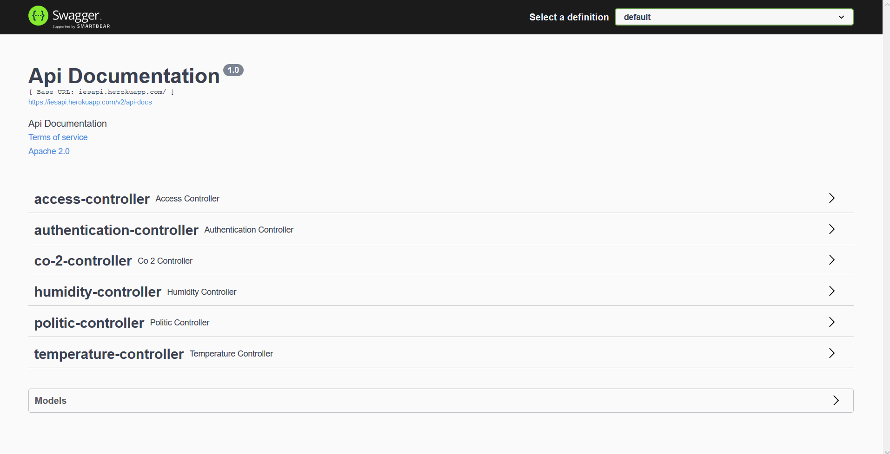
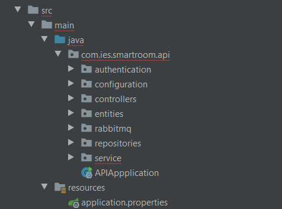
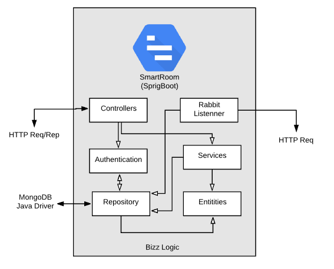

# Smart Room

A Smart Room é um projeto que se propõe a criar salas inteligentes nas quais será possível monitorização de vários aspetos que vão desde o controlo de acessos às salas, níveis de temperatura a medições de dióxido de carbono, CO2.

Aliado a uma dashboard todos os dados podem ser analisados em gráficos intuitivos que permitem melhor compreender o que se passa na sala, além disso será possível definir algumas preferências do utilizador em relação ao ambiente, podendo personalizar que alertas quer receber, bem como definir que acessos podem ser realizados na sala uma vez que será possível gerir quais os cartões autorizados ou não

## Autores
* **Team Manager**  - [Rui Coelho](https://github.com/user-cube)
* **Product Owner**  - [Jean Brito](https://github.com/JoelBrito13)
* **Architect** - [Luís Costa](https://github.com/lmcosta98)
* **DevOps master** - [Pedro Candoso](https://github.com/PBCandoso)

## Repositórios de referência:
* [Sensores](https://github.com/user-cube/Smart_Room)
* [Frontend](https://github.com/user-cube/ies_frontend)
* [Backend](https://github.com/user-cube/ies_api)
* [NFC Controller](https://github.com/user-cube/door_control_center)

### Justificação da utilização de vários repostórios
Tal como foi definido na arquitetura do projeto, dissemos que íamos criar uma pwa baseada na aplicação web, para a criação de uma pwa, a Google exige:
* Seja acessível nos seus servidores de criação
* Esteja em HTTPS# Smart Room

A Smart Room é um projeto que se propõe a criar salas inteligentes nas quais será possível monitorização de vários aspetos que vão desde o controlo de acessos às salas, níveis de temperatura a medições CO2 e humidade.

Aliado a uma dashboard todos os dados podem ser analisados em gráficos intuitivos que permitem melhor compreender o que se passa na sala, além disso será possível definir algumas preferências do utilizador em relação ao ambiente, podendo personalizar que alertas quer receber, bem como definir que acessos podem ser realizados na sala uma vez que será possível gerir quais os cartões autorizados ou não.

## Autores
* **Team Manager**  - [Rui Coelho](https://github.com/user-cube)
* **Product Owner**  - [Jean Brito](https://github.com/JoelBrito13)
* **Architect** - [Luís Costa](https://github.com/lmcosta98)
* **DevOps master** - [Pedro Candoso](https://github.com/PBCandoso)

## Repositórios de referência:
* [Sensores](https://github.com/user-cube/Smart_Room)
* [Frontend](https://github.com/user-cube/ies_frontend)
* [Backend](https://github.com/user-cube/ies_api)
* [NFC Controller](https://github.com/user-cube/door_control_center)

## Justificação da utilização de vários repositórios
Tal como foi definido na arquitetura do projeto, dissemos que íamos criar uma pwa baseada na aplicação web, para a criação de uma pwa, a Google exige:
* Seja acessível nos seus servidores de criação
* Esteja em HTTPS
* Quando feita em react usar a versão `production build`

Para que isto seja feito, um container na VM que nos foi fornecida não permite que a mesma seja criada. De modo a alcançar estes requisitos colocamos todo o nosso código no Heroku, assim, podemos fazer deploy do mesmo lá fornecendo os serviços que precisamos.
Dado as especificidade do Heroku, o deploy é mais rápido e simples quando o código se encontra em repositórios separados, dái termos tantos repositórios.

### CI/CD
Existem mecanismos de CI/CD implementados.
No que diz respeito a CI, foi feito integração com o Github Actions que trata de todo o processo de CI.
O CD ficou a cargo do Heroku que, após o Github Actions dar um parecer positivo, inicia o seu processo de deployment.

### Cloud AMQP
Uma vez que colocamos todos os serviços fora da UA, tivemos de recorrer ao alojamento do rabbit também fora da UA, para isso usamos a Cloud AMQP serviço fornecido pelos criadores do RabbitMQ.

### Mongo Atlas
Da mesma forma que tivemos de colocar o Rabbit fora da UA, fizemos o mesmo com o MongoDB, passando assim o Mongo para o Mongo Atlas serviço fornecido pelos criadores do mesmo..

### Deploy
Como foi mencionado anteriormente, colocamos tudo fora da UA, deste modo os serviços podem acedidos em:
* **Frontend** - [Heroku](https://iesfrontend.herokuapp.com/)
* **SpringBoot** - [Heroku](https://iesapi.herokuapp.com/)
* **Flask API** - [Heroku](https://ies-controller.herokuapp.com/)

**Nota**: A API não pode ser acedida no / uma vez que não tem um caminho definido para o mesmo, de qualquer modo, pode ser consultada a parte da [documentação](https://iesapi.herokuapp.com/swagger-ui.html#/)

## Links

### Backlog
Para o backlog optamos pelo Pivotal Tracker o mesmo pode ser acedido <a href="https://www.pivotaltracker.com/n/projects/2410465">aqui</a>.

### Documentos
Os documentos do projeto podem ser encontrados na pasta da Google Drive, contém sempre a versão mais atualizada dos mesmos uma vez que a ferramenta definida para a escrita de relatórios foi o Google Docs, a pasta encontra-se <a href="https://drive.google.com/drive/folders/1Q3gWHAxaBDn8KbCLEB_KCepWUc4GiT_G?usp=sharing">aqui</a>.

## Backend
Este repositório tem integração CI/CD. A parte de CI é tratada pelo Github Actions e a parte de CD é tratada pelo Heroku. 

A documentação da API foi feita utilizado o swagger que e pode ser acedida atrávez do link: [documentação](https://iesapi.herokuapp.com/swagger-ui.html#/)

### Deploy do protótipo
O deploy do protótipo pode ser encontrado <a href='deti-engsoft-02.ua.pt:3000'>aqui</a>. 
**Nota:** É necessário estar conectado na rede da UA (ou VPN) para aceder ao mesmo.

#### Token de Acesso
Com exceção do Login e da documentação construida pelo Swagger, a totalidade dos caminhos da API são bloqueados e a informação é personalizada para cada utilizador. É utilizado um JWT Token, para receber o acesso é preciso aceder ao caminho da API, [https://iesapi.herokuapp.com/login](https://iesapi.herokuapp.com/login). Uma das contas existentes é:
* **Email** - `j.brito@ua.pt`
* **Password** - `test`

Para que isto seja feito, um container na VM que nos foi fornecida não permite que a mesma seja criada. De modo a alcançar estes requisitos colocamos todo o nosso código no Heroku, assim, podemos fazer deploy do mesmo lá fornecendo os serviços que precisamos.
Dado as especificidade do Heroku, o deploy é mais rápido e simples quando o código se encontra em repositórios separados, dái termos tantos repositórios.

### CI/CD
Existen mecanismos de CI/CD implementados.
No que diz respeito a CI, foi feito integração com o Github Actions que trata de todo o processo de CI.
O CD ficou a cargo do Heroku que, após o Github Actions dar um parecer positivo, inicia o seu processo de deployment.

### Cloud AMQP
Uma vez que colocamos todos os serviços fora da UA, tivemos de recorrer ao alojamento do rabbit também fora da UA, para isso usamos a Cloud AMQP serviço fornecido pelos criadores do RabbitMQ.

### Mongo Atlas
Da mesma forma que tivemos de colocar o Rabbit fora da UA, fizemos o mesmo com o MongoDB, passando assim o Mongo para o Mongo Atlas serviço fornecido pelos criadores do mesmo.

## Links

### Backlog
Para o backlog optamos pelo Pivotal Tracker o mesmo pode ser acedido <a href="https://www.pivotaltracker.com/n/projects/2410465">aqui</a>.

### Documentos
Os documentos do projeto podem ser encontrados na pasta da Google Drive, contém sempre a versão mais atualizada dos mesmos uma vez que a ferramenta definida para a escrita de relatórios foi o Google Docs, a pasta encontra-se <a href="https://drive.google.com/drive/folders/1Q3gWHAxaBDn8KbCLEB_KCepWUc4GiT_G?usp=sharing">aqui</a>.

### Arquitetura 
Foram contruidos 5 modulos para a Repositório, Entidades, Serviços, Autenticação, Controlos, que se comunicam entre si para o funcionamento da API. Para além destes módulos, existe um para tratar da documentação e configuração e um para receber e armazenar as mensagens provenientes do rabbitmq. 

#### A comunicação entre os módulos pode ser vista aqui:

### Caminhos da API 
A API pode ser dividida em 3 categorias. Autenticação, Coleta de Informações e Configuração.

* **Autenticação:** É responsavel pela autenticação do utiliador e retornar um JWT Token com a informação da casa, email e nome do utilizador. Este token é enviado de volta a API para assegurar que o pedido é feito por um utilizador válido.

* **Coleta** **de** **Informações:** São os controles de Humidade, Co2, Temperatura e os Acessos. Para estes controles só é permitido a leitura de informação, ou seja, apenas métodos `GET`.

* **Configuração:** São os controles de Politica e as Credenciais `access/credential/`, nestes são permitidos os métodos padrões `PUT`, `POST` e `DELETE`, além é claro de poder consultar a informação via `GET`.

